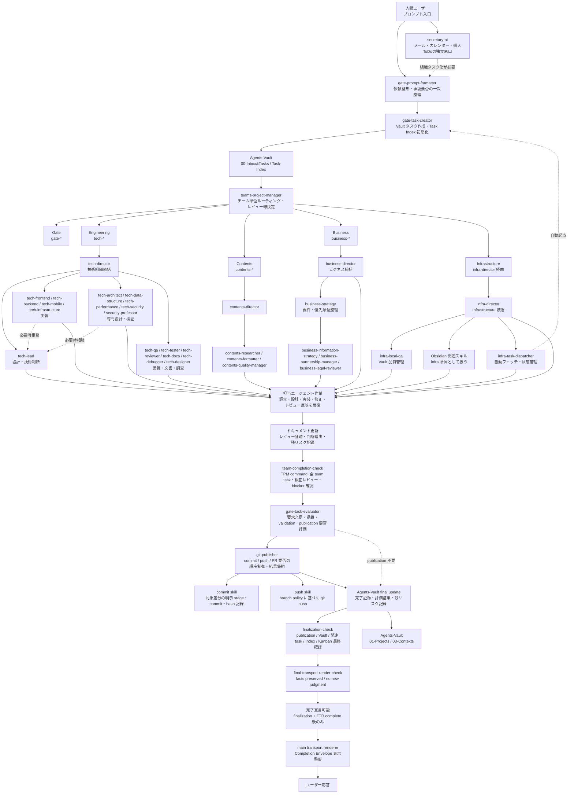

# AI Organization

このノートは AI 組織フロー全体の正本。

`~/dotfiles/COMMON-AGENTS.md` は、全エージェント共通の最小入口ルールだけを持つ。
人間ユーザーからのプロンプト入力は、実作業や個別スキルより先に必ず `gate-prompt-formatter` へ中継する。

`gate-prompt-formatter` 以降の流れは、このノート、Gate I/O Contract、Dispatcher I/O Contract、各スキルの Flow Contract / SKILL.md、ITB model registry が正本になる。Vault、Task Index、Kanban は複数 Organization Instance から更新され得る共有資源であり、GTC / infra-task-dispatcher が排他・重複検出・同期確認を担う。

TSK-1244 以降、組織メンバーの実行単位は「Skill を直接呼ぶこと」ではなく、`infra-team-bootstrap` の role-agent registry、durable queue、独立 worker process によって管理する。Skill はロール定義と Flow Contract の正本であり、実行中のチーム構成、provider、model、queue consumer、worker process は registry / model-registry / runtime evidence を正本にする。
Completion Gate の機械検証用チェーン、pre-final 必須 section、main-agent 禁止 role 集合は `organization/runtime/infra-team-bootstrap/config/completion-chain.yaml` を正本とする。このノート内の図表は説明用であり、ITB builder / Gate role は config を参照する。

## 最重要原則

- 実施内容、判断、調査、レビュー、引き継ぎは必ず Vault に残す
- Vault に残っていない知識は共有済みとして扱わない
- タスク完了には成果物だけでなく Vault 更新、必要な commit、関連タスク完了確認が必要
- `done` は成果物完成ではなく、`team-completion-check`、`gate-task-evaluator`、Git publication / Vault final update、`finalization-check`、`Final Transport Render Check` が完了した状態だけを指す
- No Task, No Execution を組織フローの実行ゲートとする。人間起点の依頼は、GTC 起票成果物が揃うまで個別スキル、調査、編集、git 操作、レビュー、コミット、スキル更新に進まない

## 実行前チェック

人間起点の作業は、次の全項目が true になってから実作業へ進む。1 つでも false の場合は作業を停止し、`GTC 未実施のため実行不可` と明示する。

| Check | Required Evidence |
|---|---|
| `gate_intake_envelope_created` | `gate-prompt-formatter` が元依頼、意図、成果物、承認要否、task units を含む `Gate Intake Envelope` を作成している |
| `task_detail_created_or_updated` | `gate-task-creator` が Task Detail を作成または既存 Task Detail を更新している |
| `task_index_synced` | `00-Inbox&Tasks/Task-Index.md` に Task Detail への wikilink がある |
| `kanban_synced` | `00-Inbox&Tasks/Kanban.md` の status 対応セクションに同一 Task が 1 回だけある |
| `project_manager_handoff_created` | Task Detail に `Project Manager Handoff` があり、`teams-project-manager` へ渡せる |
| `review_line_defined` | レビュー証跡要件、レビュー担当、人間承認要否が Task Detail または handoff に記録されている |
| `organization_instance_bootstrapped` | ITB により Organization Instance が ready または already_ready である |
| `team_roster_recorded` | Task Detail または Project note に Organization Active Set がある |
| `active_set_declared` | Gate core / Infra core、on-call role、タスク別 active set が記録されている |

実行後に GTC 未実施が判明した場合、その作業は完了扱いにしない。逸脱 Task として原因、影響、未完了 gate、再発防止を Vault に記録する。

## チーム

| チーム | Prefix | 例 |
|---|---|---|
| Gate | `gate-` | `gate-task-creator` |
| Engineering | `tech-` | `tech-lead` |
| Contents | `contents-` | `contents-formatter` |
| Business | `business-` | `business-strategy` |
| Infrastructure | `infra-` | `infra-team-bootstrap`, `infra-director` |

`teams-project-manager` は人間ユーザーのことではなく、チーム単位のルーティング、レビュー線、実行順序、各チーム director への handoff を担う組織横断ロールとして扱う。既存ノートの `project-owner` は旧称 alias として読む。

TPM のタスク割り振りはチーム単位までに限定する。Engineering 内の担当は `tech-director`、Contents 内の担当は `contents-director`、Business 内の担当は `business-director`、Infrastructure 内の担当は `infra-director` が決める。

## 委譲原則

| 原則 | 内容 |
|---|---|
| COMMON の責務 | 人間ユーザーからのプロンプト入力を必ず `gate-prompt-formatter` に渡す |
| 次ホップ責務 | 次に渡すエージェントは、移譲元エージェントが把握する |
| 全体像の所在 | 組織フロー全体はこのノートで確認する |
| 個別契約の所在 | 受け渡し形式、必須フィールド、完了条件は各 I/O Contract と各 SKILL.md に置く |

COMMON にすべての経路を重複記述しない。
各エージェントは、自分の前ロール、入力、出力、必須次ロールだけを直接知っていればよい。新規・更新される Team Role は SKILL.md 前半に `Flow Contract` を持ち、Input Agents、Output Agents、Required Handoff Artifact、Return Policy、Forbidden Outputs を明示する。


## Organization Instance Lifecycle

組織運用では、チャットセッションを 1 つの Organization Instance として扱う。
SessionStart Hook は metadata-only の初期化だけを行い、role dispatch や provider 実行を開始しない。

| Concept | Rule |
|---|---|
| Skill | ロール定義。例: `gate-prompt-formatter` |
| Agent Instance | チャットセッションごとの論理実行単位 |
| Organization Instance | 1 チャット内の組織 context と role metadata |
| Project | 原則 1 Organization Instance に紐づく |

複数プロジェクトを並行する場合は、プロジェクトごとに別チャット、別 Organization Instance を使う。GPF は session-local agent instance とし、全チャット横断の singleton にしない。

| Lifecycle Event | Handler | Result |
|---|---|---|
| `SessionStart` | `infra-team-bootstrap` | session metadata と execution context pointer を作成 |
| `Stop` | `infra-team-bootstrap` | typed execution context を読み、allow/block verdict を返す |
| Task intake | `gate-prompt-formatter` | Gate Intake Envelope |
| Explicit archive / close | `infra-team-bootstrap` archive mode | Handoff summary と archived context |

ユーザー発話は常に `gate-prompt-formatter` へ渡す。`チームを起動して` という発話も ITB 直通にしない。GPF が動く時点で Organization Instance / execution context pointer が存在しない場合は、GPF が起動を代行せず `bootstrap_missing` policy violation として停止する。

## Role-Agent Queue Operating Model

組織運用では、メインエージェントがサブエージェントを内側で再帰的に呼び出すのではなく、各 role agent が共通 queue と explicit CLI dispatch を介して作業する。
Hook は queue progression、auto scaffold、role dispatch、LLM/provider call を開始しない。

| Layer | Source of Truth | Rule |
|---|---|---|
| Role definition | 各 `SKILL.md` | 責務、Flow Contract、入力、出力、禁止事項を定義する |
| Team membership | `organization/runtime/infra-team-bootstrap/config/role-agent-registry.yaml` | Organization Instance で利用可能な role metadata を定義する |
| Model / provider | `organization/runtime/infra-team-bootstrap/references/model-registry.md` | `intended_model`、provider、execution mode を定義する |
| Runtime queue | `<ITB_STATE_ROOT>/<session>/queue/` | inbox、task payload、report、lock を保持する。git 管理対象にしない |
| Runtime worker | explicit CLI provider call | pending message を claim し、report YAML と provider evidence を書く |
| Human-readable record | Agents-Vault Task Detail / team `tasks.md` | queue 実行結果、判断、レビュー、残リスクを再利用可能な形で記録する |

### Queue Flow

```text
human request
  -> gate-prompt-formatter intake
  -> queue/inbox/gate-prompt-formatter.yaml
  -> explicit CLI dispatch
  -> queue/reports/gate-prompt-formatter/<task>/...
  -> gate-task-creator inbox
  -> teams-project-manager inbox
  -> Director / member role inbox
  -> Completion Gate
```

queue write は配送証跡であり、provider 実行は explicit CLI dispatch の report evidence で確定する。
enqueue だけでは作業完了扱いにしない。

### Role Dispatch Rules

| Rule | Meaning |
|---|---|
| Queue first | 次ロールへの依頼は queue message として残す。口頭で「役割を読んだ」だけでは委譲完了ではない |
| No nested subagent dependency | サブエージェントがさらにサブエージェントを直接起動する構造を前提にしない。追加担当が必要な場合は queue に戻す |
| Independent CLI call | role agent 実行は `claude --print --output-format json` または `codex exec --ephemeral --json` のような one-shot CLI evidence として扱う |
| Provider evidence required | local stub 以外の provider 実行は `provider_session_id`、`request_id`、`effective_model`、`usage_source`、`transcript_path` を report に残す |
| Model self-report is not evidence | 生成本文内のモデル名ではなく、CLI output、transcript、session log を `effective_model` の証跡にする |
| Skill is not active set | `tech-*`、`contents-*` などのメンバーを Skill 直下に置く必要はあるが、タスク別 active set は Skill 一覧ではなく registry と Task Detail で管理する |

### Migration Validation Evidence

TSK-1244 でこの運用へ移行した時点の検証証跡は次を参照する。

| Evidence | Link |
|---|---|
| Claude / Codex live E2E and worker evidence | [[01-Projects/AI-Agent-Organization/TSK-1244-shogun-org-architecture-migration/reviews/tech-tester-unit5-live-e2e]] |
| Unit-5 QA verdict | [[01-Projects/AI-Agent-Organization/TSK-1244-shogun-org-architecture-migration/reviews/tech-qa-unit5]] |

## Codex Goal Operating Policy

Codex runtime の `goal` は、単独エージェントが全部を自走するための仕組みではなく、GTC 起票済みの親タスクを Director / Gate / PM が完了まで運行し続けるための看板として扱う。

| Rule | Meaning |
|---|---|
| `goal = parent task banner` | goal は parent Task Detail と Task ID に紐づく進行状態であり、作業主体そのものではない |
| Goal owner | `teams-project-manager`、各 team Director、または Gate 固定ロールが owner になれる |
| Execution owner | 実作業は active set に載った role / team member へ explicit CLI dispatch する |
| Codex / Claude main work | main chat agent は transport / queue / validation の制御面だけを担う。実作業完了 evidence として `main-agent`、`codex-main`、`claude-main` を使ってはならない |
| Delegation evidence | `Invocation Evidence` に agent、intended/effective model、request/session、usage source、result を残す |
| Role Execution Evidence | Gate evidence とは別に、最低 1 つの non-gate execution role が provider-backed usage source で complete している必要がある |
| Complete gate | `goal complete` は `finalization-check` complete と main transport renderer の `Final Transport Render Check` 後だけ許可する |

通常フローは次の順序を正とする。

```text
GPF -> gtc-scaffold / GTC fallback -> optional create_goal(parent task) -> TPM -> Director -> active-set CLI dispatch -> team-completion-check -> GTE -> git publication / Vault final update -> finalization-check -> final transport render check -> main transport renderer -> update_goal complete
```

`create_goal` は GTC / `gtc-scaffold` による Task Detail 作成後にだけ parent Task ID へ紐づける。Task ID がない状態の provisional goal は作らない。`update_goal complete` は `Final Transport Render Check` 後にだけ実行し、`finalization-check` complete 前、Vault final update 前、または final transport render 前に complete 扱いしない。

## User Interface Style Contract

妹文体はユーザー表示だけの UI style profile として扱う。
作業エージェント、Gate 判定、review evidence、Vault 正本には人格・文体コンテキストを載せない。

| Layer | Rule |
|---|---|
| Work roles | 厳格な業務文体で実装、調査、レビュー、判断を行う |
| Gate roles | 証跡、判定、契約を厳密に扱い、文体変換をしない |
| `finalization-check` | Completion Envelope を facts / risks / artifacts / publication evidence として閉じる builder command |
| main transport renderer | `Final Transport Render Check` 済み Completion Envelope だけを、事実保持のままユーザー表示へ整える |
| `gate-response-humanizer` | 旧 mandatory final role。現行では文体 profile の compatibility / reference として扱う |

main transport renderer は作業 evidence ではない。
`Final Transport Render Check` では、`facts_preserved: true`、`no_new_task_judgment: true`、`worker_persona_leakage: false`、`style_profile` を記録する。
main transport renderer が実装、調査、レビュー、完了判定を代行した場合は main agent bypass として扱い、完了 evidence にしてはならない。

## Organization Active Set

組織ロールは作業セッション内の metadata として登録され、タスクごとに active set へ選出される。
metadata 登録は provider 応答、CLI 実行、作業完了を意味しない。

| 状態 | 意味 |
|---|---|
| `metadata_ready` | role metadata が作成済み。provider 応答済みではない |
| `active` | 現タスクで判断、作業、レビュー、同期、完了確認を担当する論理状態 |
| `deferred` | 利用可能だが現タスクでは対象外 |
| `response_active` | provider session / request / effective model / usage evidence 付きで応答済み |
| `resetting` | タスク切替のため要約保存と `/clear` / `/compact` / `/new` を実施中 |
| `unavailable` | モデル不一致、CLI 不在、session 不明などで使えない |

Gate core と Infra core は全タスク横断の運行責務を持つ。ただし `always_active` は provider response ready を意味しない。
provider response evidence は Invocation Evidence と queue report で管理する。

| Team | Core Always Active Roles |
|---|---|
| Gate | `gate-prompt-formatter`, `gate-task-creator`, `teams-project-manager`, `gate-task-evaluator` |
| Infrastructure | `infra-team-bootstrap`, `infra-director` |

`gate-task-assessor` と `gate-task-guardian` は旧フロー互換の参照ロールであり、新規 task の execution role / queue consumer / provider turn として起動しない。assessor 相当の確認は TPM が `team-completion-check` command evidence を正本に行い、guardian 相当の最終確認は Vault final update 後の `finalization-check` command と `final-transport-render-check` が担う。

`infra-task-dispatcher` と `infra-local-qa` は Infrastructure の on-call role として扱い、自動巡回、状態同期、Vault QA が必要なときだけ active 化する。Tech、Contents、Business の role も TPM または各 director がタスクごとに active 化する。active ではない role は成果物作成、レビュー、Vault 更新を行わない。

bridge、commit、git-publisher、push、git-workspace-prep、save、Obsidian CLI、browser などの道具スキルは組織 role ではなく一時実行ツールとして扱う。ユーザーが明示した場合または Completion Gate / Branch Plan から必要になった場合だけ一時的に呼び出し、active set には入れない。

Task Detail または Project note には、少なくとも次を記録する。

| Field | Meaning |
|---|---|
| `role_id` | 論理ロール ID。例: `gate-prompt-formatter` |
| `agent_instance_id` | チャットセッションごとの実 agent instance ID |
| `organization_instance_id` | チャット単位の Organization Instance ID |
| `context_scope` | `session` を既定とする |
| `chat_session_id` | 紐づくチャット/作業セッション ID |
| `project_id` | 紐づく Project ID または Vault project slug |
| `lifecycle_status` | `metadata_ready` / `active` / `deferred` / `archived` / `failed` |
| `agent_id` | 正式ロール ID |
| `team` | `gate` / `tech` / `contents` / `business` / `infra` |
| `activation_status` | `metadata_ready` / `active` / `deferred` / `response_active` / `resetting` |
| `metadata_status` | role metadata の作成状態 |
| `tool_sidecar_status` | `not_started` / `deferred` / `ready` / `not_verified` |
| `response_status` | `not_invoked` / `invoked` |
| `always_active` | Gate core / Infra core の運行責務。provider response ready を意味しない |
| `provider` | `anthropic` / `openai` |
| `intended_model` | `infra-team-bootstrap/references/model-registry.md` の `primary_model` |
| `effective_model` | provider output / session log で確認した実モデル |
| `execution_mode` | `agent` / `codex` / `chat` / `long-run` |
| `session_id` | Claude output sessionId、Codex session id など |
| `last_request_id` | 最後に確認した requestId |
| `usage_source` | `claude_print_json`、`codex_exec` など |
| `active_for_task` | 現在担当中の Task ID。非担当なら空 |
| `last_reset_at` | タスク切替時のリセット時刻 |
| `last_seen_at` | 最後に evidence を確認した時刻 |
| `notes` | fallback、alias 解決、障害メモ |

## 入口フロー

| 順序 | 担当 | 役割 |
|---|---|---|
| 1 | `gate-prompt-formatter` | 人間ユーザーのプロンプト起点で、依頼文の整形と承認要否の一次整理を行う |
| 2 | `infra-task-dispatcher` | 自動起点で、候補タスクのフェッチと起票前の収集を行う |
| 3 | `gate-task-creator` | 人間起点 / 自動起点の両方を受けて Vault タスクを作成し、Task Index を初期化する |
| 4 | `teams-project-manager` | 主担当チーム、支援チーム、レビュー証跡要件、実行順序、Branch Plan、Active Set、director handoff の決定 |

## 組織フロー全体



## 起動時プロトコル

| 順序 | 必須動作 | 強制内容 |
|---|---|---|
| 1 | 正本確認 | `COMMON-AGENTS.md`、このノート、Agents-Vault を確認し、Vault 未記録の知識を共有済み事実として扱わない |
| 2 | タスク起点判定 | 人間ユーザーのプロンプト起点か、`infra-task-dispatcher` の自動フェッチ起点かを判定する |
| 3 | 入口整形 / 候補収集 | 人間起点では ITB が `gate-prompt-formatter` inbox へ queue message を作成し、自動起点では `infra-task-dispatcher` が候補タスクを収集する |
| 4 | タスク作成 | `gate-task-creator` がどちらの起点でも `00-Inbox&Tasks` と `Task-Index.md` に初期タスクを作成する |
| 4.5 | 実行前チェック | Organization Instance、`Gate Intake Envelope`、Task Detail、Task Index、Kanban、Project Manager Handoff、review line、Organization Active Set、Queue Evidence が揃うまで実作業に進まない |
| 5 | ルーティング | `teams-project-manager` が主担当チーム、支援チーム、Branch Plan、Gate/Infra core、on-call role、タスク別 active set を決め、各 director へ渡す |
| 5.5 | Workspace prep | Git 管理対象の作業で Branch Plan がある場合、`git-workspace-prep` が task 共有 branch を準備する。`main-push-repos.md` 記載 repo の default branch 作業は `branch_action: none` として branch を切らない |
| 6 | レビュー証跡要件設定 | 成果物の性質に応じて、チーム内相互レビュー、別観点レビュー、人間承認要否を先に決める。レビューは独立ステージではなく、Director 作業、`team-completion-check`、GTE が確認する証跡として扱う |
| 7 | 担当エージェント作業 | 主担当と支援担当が、相談、修正、レビュー反映、整合性確認を含む作業ループを反復する |
| 8 | タスク状態管理 | `Task-Index.md` または関連タスク詳細に状態、判断、成果物、レビュー結果を記録する |
| 9 | 担当作業・レビュー証跡・Vault更新 | `担当エージェント作業`、レビュー証跡、ドキュメント更新が揃うまで後段 Gate へ進まない |
| 10 | Team completion check | 各 Director の structured completion signal を受け、TPM が `team-completion-check` command で全 team task、相互レビュー、blocker、承認待ちの有無を確認する |
| 11 | Evaluator | `gate-task-evaluator` が品質、要求充足、validation、commit / push / PR 要否を確認し、`main-push-repos.md` の default branch push whitelist を参照して Git Publication Manifest を作る |
| 12 | Git publication / Vault final update | publication が必要なら `git-publisher` が commit / push / PR を専用スキルへ委譲して Git Publication Result を記録し、その後 Vault final update を行う |
| 13 | Finalization check | Vault final update 後に `finalization-check` command が関連 task、Git Publication Result、Vault、Index、Kanban、Organization Active Set、Invocation Evidence、Completion Envelope の完了証跡を確認する |
| 14 | 人間承認 | 設計変更、要件追加、権限モデル変更、方針転換は人間承認なしに進めない |

## Gate I/O Contract

Gate 系ロール間の受け渡し形式は [[03-Contexts/Policies/Gate-IO-Contract]] に整理する。

この契約は `gate-prompt-formatter`、`gate-task-creator`、`teams-project-manager`、`gate-task-evaluator`、`finalization-check`、main transport renderer の間で、元依頼、正規化依頼、承認要否、タスク単位、ルーティング候補、レビュー証跡要件、Vault 更新先、最終表示チェックをどう渡すかを定義する。

`infra-task-dispatcher` の採番、状態同期、Kanban 連携は [[03-Contexts/Policies/Dispatcher-IO-Contract]] を正とする。

## レビュー原則

- 単独エージェントで完了宣言しない
- `担当エージェント作業`、レビュー証跡、`ドキュメント更新` を通す
- Team Director 完了後は TPM の `team-completion-check`、品質評価とレビュー証跡確認は `gate-task-evaluator`、最終完了保証は `finalization-check` が担う
- Git 管理対象の変更は Git Publication Result または publication 不要判断がない限り `done` にしない
- 設計変更は人間承認が必要
- `finalization-check` と `Final Transport Render Check` が complete と判定した Completion Envelope だけを main transport renderer が最終応答に整える


## Completion Gate

Team Director が自チームの完了を報告した後は、次の後段 Gate を必ず通す。

| 順序 | ロール | 責務 | 次へ進める条件 |
|---|---|---|---|
| 1 | `team-completion-check` | TPM command が全 team task、相互レビュー、blocker、依存、承認待ちを集約確認 | `assessment_status: ready_for_evaluation` |
| 2 | `gate-task-evaluator` | 成果物品質、要求充足、review、validation、commit / push / PR 要否を評価 | `evaluation_status: quality_ok` |
| 3 | `git-publisher` | Git Publication Manifest に従い、commit / push / PR を専用スキルへ委譲して Git Publication Result を記録 | `git_publication_status: complete` または `not_required` |
| 4 | Agents-Vault final update | 評価結果、publication 証跡、残リスク、完了判断を Task Detail に記録 | final update 完了 |
| 5 | `finalization-check` | 関連 task、team task、review、human approval、Git Publication Result、Vault、Index、Kanban、Completion Envelope を最終確認 | `finalization_status: complete` |
| 6 | `final-transport-render-check` / main transport renderer | finalization complete 済み Completion Envelope を facts-preserved / no-new-task-judgment として確認し、人間向け最終応答に整える | ユーザー応答 |

main transport renderer は完了判定を行わない。`finalization-check` complete と `Final Transport Render Check` がない Completion Envelope は最終応答にしてはならない。

## Tech 作業ループ

- `tech-frontend` `tech-backend` `tech-mobile` `tech-infrastructure` `tech-architect` `tech-security` などは、必要に応じて `tech-lead` に相談する
- `tech-qa` `tech-tester` `tech-reviewer` `tech-debugger` `tech-docs` `tech-designer` は、後段で孤立した別系統ではなく、`担当エージェント作業` の反復ループで品質管理と修正反映に参加する
- そのため、成果物品質は `担当エージェント作業` の中で、修正、レビュー、整合性確認を反復して仕上げる

## Business 階層

- 最上位は `business-director`
- `business-strategy` はその一段下で、要件整理と優先順位付けを担う

## Infrastructure 階層

- 最上位は `infra-director`
- `infra-director` は TPM から渡された infra チームのタスクについて、`infra-task-dispatcher`、`infra-local-qa`、Obsidian 関連スキルの使い分けとレビュー線を調整する
- TPM は Infrastructure へ渡すところまでを担当し、infra チーム内の個別担当は `infra-director` が決める

## Secretary AI Boundary

`secretary-ai` はメール、カレンダー、個人 ToDo、ブリーフィングの独立ワークフローとして扱う。
予定参照、メール要約、返信ドラフト、個人 ToDo の追加や完了は、組織タスク化せず secretary-ai の安全ルール内で扱ってよい。

ただし、メールやカレンダーから派生した依頼がコード修正、調査、レビュー、方針変更、Vault ポリシー更新、スキル修正など組織タスクに該当する場合、secretary-ai は直接実行しない。
その場合は `gate-prompt-formatter -> gate-task-creator` に渡せる起票用依頼文を作り、GTC の Task Detail / Task Index / Kanban / Project Manager Handoff が揃ってから実作業へ進む。

## モデル運用

- Team Role のモデル設定は `organization/runtime/infra-team-bootstrap/references/model-registry.md` を正本にする
- Team Role `SKILL.md` はロール定義、Flow Contract、責務境界を持ち、`primary_model` などのモデル設定を持たない
- `primary_model`、`fallback_models`、`execution_mode`、`long_run_preferred` は model registry から取得する
- `intended_model` は model registry、`effective_model` は transcript / session log の証跡を正本にする

## Dispatcher I/O Contract

`infra-task-dispatcher` の受付、採番、状態同期、完了条件は [[03-Contexts/Policies/Dispatcher-IO-Contract]] に整理する。

この契約は `Task-Gateway.md`、`Task-Index.md`、`Kanban.md`、Task Detail の関係を定義する。
`Task Detail` の `status` を正とし、`Task-Index.md` と `Kanban.md` はそこから同期する。

タスクノートの配置先、ファイル名、粒度判断（個別ノート vs バックログ束ね）、Project フォルダ選定は [[03-Contexts/Policies/Task-File-Conventions]] を正本とする。

| Status | Kanban Section | 用途 |
|---|---|---|
| `inbox` / `triage` | Inbox | 未正規化、分類中 |
| `ready` | Ready | 着手可能 |
| `in_progress` | In Progress | 実行中 |
| `domain_review` / `independent_review` | Review | 既存互換のレビュー状態。新規タスクでは独立ステージとしては使わず、Completion Gate のレビュー証跡として扱う |
| `waiting_human` / `blocked` | Waiting Human | 人間判断または解除条件待ち |
| `done` / `archived` | Done | 完了または履歴化 |
